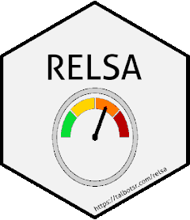

<!-- README.md is generated from README.Rmd. Please edit that file -->

# endpointR 


```{r, include = FALSE}
knitr::opts_chunk$set(
  collapse = TRUE,
  comment = "#>",
  fig.path = "man/figures/README-",
  out.width = "100%"
)
```
# endpointR

<!-- badges: start -->
<!-- badges: end -->

The goal of endpointR is to ...

## Installation
You can install the development version from [GitHub](https://github.com/) with:

``` r
# install.packages("devtools")
devtools::install_github("mytalbot/endpointR")
library(endpointR)
```
## Example

This is a basic example uses the internal Glioma data from Helgers & Talbot et al 2019 to indicate potential endpoints for individual animals. The input variables are raw body weight data.

```{r example}
library(endpointR)
a      <- 1
td     <- ep_select(gliodat, a) 
danger <- epR(td        = td,
              org       = FALSE,
              wl        = 6,
              SDwdth    = 2,
              mad       = FALSE,
              blind     = TRUE)
danger
```
